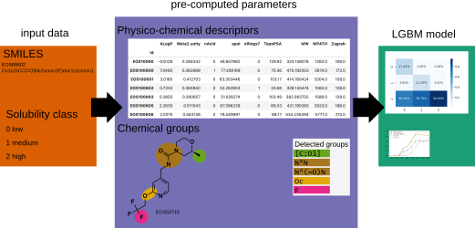

# Solubility of the small molecules

This project was created during participation in the Kaggle competition
([1st EUOS/SLAS Joint Challenge: Compound Solubility](https://www.kaggle.com/competitions/euos-slas/rules)).
There are several model, the best one is 27th place in the leaderboard.

# Abstract

The solubility is quite challenging parameter for prediction, a lot of factors influence on it: hydrophilicity, polarity, dipol moment, 
flexibility, charges, 3D shape of the molecule. So, it seems important to give to the model these pre-computed parameters. 
Moreover, in the medicinal chemistry there are known fragments/groups which usually increase / decrease solubility.
I included information about presence or absence of the such groups.

So, the dataset contains the following parameters: 
- parameters for phisics-based modeling (descriptors including 3D, obtained from protonated 3D conformers).
- occurrence of the knowledge-based chemical groups

This dataset was used in the different models: sklearn classifiers, pytorch, tensorflow deep neural networks. 

# Methods and data

## Dataset

The input data contains chemical structures (SMILES format) and solubility (three classes: 0 (low), 1 (medium), 2 (high)).
 The data is highly unbalanced: 93% of compounds belong to the high-soluble class.


## Workflow

All derivative data is stored in `derived` folder.

1. Extract smiles **compounds.smi**
2. De-salt (obabel -r -xc ...) **compounds_desalt.smi**
3. Calculate fragments composition by **gen_substr.py**
4. Generate 3D structures by ballon (3d), protonate by open babel at pH=7 (3dH)
5. Generate descriptors (CDK and BleDesc)
6. Collect the data using *preprocess.py*

The final pre-computed parameters are in the **preprocessed** folder.

## Pre-computed parameters

There are 203 parameter (see the names in [file](docs/parameters.txt))
- 151 physico-chemical descriptors ()
- 52 chemical fragments 

 
## Files with data

All data is stored in data folder:

```
data/
├── generate_smi.sh
├── preprocessed
│   ├── test.pk
│   ├── X.pk
│   └── Y.pk
├── preprocess.py
└── raw
    ├── 50_most_popular_groups.txt
    ├── example_predictors.csv
    ├── submission_template_rdm.csv
    ├── test.csv
    └── train.csv
```
Add data file should contain 'Id' field with IDs of the molecules.

The final data for ML/NN is in the `preprocessed` folder (pandas pickle files).
Data is raw (not normalized)
X.pk - features with names (**Id**)
Y.pk - labels
test.pk - data for prediction

